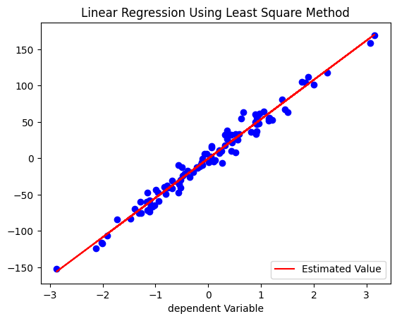
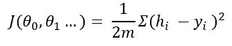
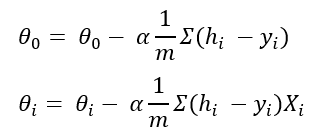
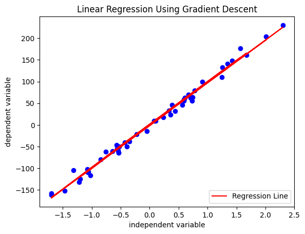
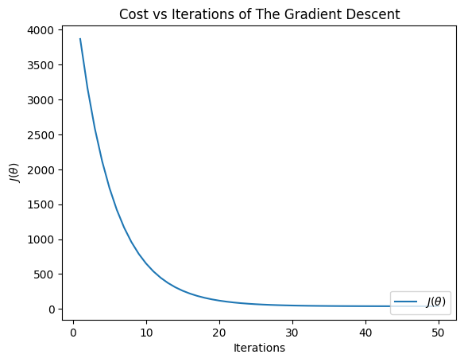

# Regression Analysis

In this repository you can find everything you need to know about regression analysis, starting with the simple example of linear regression, and ending with the general model which is polynomial regression.

---

### Introduction :

Regression analysis is a set of statistical operations to estimate the relationships between a dependent variable (X) and an independent variables (Y).
The most Simple form of regression analysis is linear regression , where the goal is to  finds a suitable line that will fit our data , but sometimes linear regression is not suitable for the problem, since there is a polynomial relationship between the dependent variable (X) and the independent variables (Y).

### Linear Regression :
Linear Regression Model can be represented Mathematically Using This Formula :

<div align="center" >

</div>

where X is our dependent variable and Y is our independent Variable , alpha and beta are the model parameters , and epsilon is the Error .

**1. Linear Regression with Least Squares Method .**

The method of least squares is a standard approach in regression analysis to approximate the solution , by minimizing the sum of the squares of the residuals made in the results of every single equation.

Least Squares Method Estimate the Parameters alpha and beta Using This Simple Formula :


<div align="center" >

</div>

The Implementation of Linear Regression with Least Squares in Python :

```python
import numpy as np
import matplotlib.pyplot as plt
from sklearn.datasets import make_regression

x , y = make_regression(n_samples=100 , n_features= 1 , noise=10)

"""
Our Linear Model Looks like this :   Y_estimated = theta[0] + theta[1] * x .
our goal is to compute the coefficients Theta[0] and Theta[1] that will fit our data correctly,
Using Least Square Method . 

"""

# Calculating The Mean for x and y
X_mean = np.mean(x)
Y_mean = np.mean(y)

# Calculating The Coefficient Theta_1
num = np.sum( (x[i] - X_mean)*(y[i] - Y_mean) for i in range(len(x)) )
den = np.sum( (x[i] - X_mean)**2 for i in range(len(x)) )
theta_1 = num / den

# Calculating The Coefficient Theta_0
theta_0 = Y_mean - theta_1 * X_mean

# Calculating The Estimated Y
Y_estimated = theta_0 + theta_1 * x

# Plot The Result

plt.figure()
plt.scatter(x , y , color='blue')
plt.plot(x , Y_estimated ,"-r" ,label = 'Estimated Value' )
plt.xlabel('Independent Variable')
plt.xlabel('dependent Variable')
plt.title('Linear Regression Using Least Square Method')
plt.legend(loc = 'lower right')
plt.show()

```
The Least Squares Method Gives us This beautiful line :

<div align="center" >

</div>


**2. Linear Regression With Gradient descent .**
Gradient descent is a first-order iterative optimization algorithm for finding a local minimum of a differentiable function. The idea is to take repeated steps in the opposite direction of the gradient of the function at the current point .

<div align="center" >

</div>

in this time we know which Algorithm , we're gonna use for the Optimization process , but wait a minute  **which function we're gonna optimize ?**

Ladies and gentlemen, this function is called the cost function and it is used to measure the difference between the expected value and the real value, we can see it as the function that gives us an idea of how far away the expected value from the real .

in our case the cost function is defined as below :

<div align="center" >

</div>

The Derivative of The Cost function with respect to the parameters is :

<div align="center" >

</div>

The Implementation of Linear Regression with Gradient Descent in Python :


```python
import numpy as np
import matplotlib.pyplot as plt
from sklearn.datasets import make_regression

class LinearRegression :
    
    def __init__(self , x , y):
        self.x = x
        self.y = y
    
    def compute_hypothesis(self , theta_0 , theta_1 , x):
        h = theta_0 + np.dot(x , theta_1)
        return h
    
    def compute_cost(self , theta_0 , theta_1 , x , y):
        h = self.compute_hypothesis(theta_0 , theta_1, x)
        error = 1/(2 * len(x)) * np.sum((h - y) **2)
        return error
    
    def compute_gradients(self , theta_0 , theta_1 , x , y):
        h = self.compute_hypothesis(theta_0 , theta_1, x)
        error = h - y
        d_theta_0 = (1/len(x)) * np.sum(error)
        d_theta_1 = (1/len(x)) * np.dot(error , x)
        
        return d_theta_0 , d_theta_1
    
    def fit(self , learning_rate = 10e-2 , nbr_iterations = 50 , epsilon = 10e-3):
        
        theta_0 , theta_1 = np.random.randn(self.x.shape[0]) , np.random.randn(1)
        costs = []
        
        for _ in range(nbr_iterations):
            
            d_theta_0 , d_theta_1  = self.compute_gradients(theta_0 , theta_1, self.x, self.y)
            
            theta_0 -= learning_rate * d_theta_0
            theta_1 -= learning_rate * d_theta_1
            cost = self.compute_cost(theta_0 , theta_1, self.x, self.y)
            costs.append(cost)
            
            if cost < epsilon :
                break
        self.theta_0 = theta_0
        self.theta_1 = theta_1
        self.costs = costs
        self.nbr_iterations = nbr_iterations                
    
    def plot_line(self):
        plt.figure()
        plt.scatter(self.x, self.y, color = "blue")
        h = self.compute_hypothesis(self.theta_0 ,self.theta_1, self.x)
        plt.plot(self.x , h , "-r" ,label="Regression Line")
        plt.xlabel("independent variable")
        plt.ylabel("dependent variable")
        plt.title("Linear Regression Using Gradient Descent")
        plt.legend(loc = 'lower right')
        plt.show()
    
    def plot_cost(self):
        plt.figure()
        plt.plot(np.arange(1, self.nbr_iterations+1), self.costs, label = r'$J(\theta)$')
        plt.xlabel('Iterations')
        plt.ylabel(r'$J(\theta)$')
        plt.title('Cost vs Iterations of The Gradient Descent')
        plt.legend(loc = 'lower right')

if __name__ == "__main__" :
    x , y = make_regression(n_samples=50 , n_features=1 , noise=10)
    Linear_Regression = LinearRegression(x, y)
    Linear_Regression.fit()
    Linear_Regression.plot_line()
    Linear_Regression.plot_cost()
```

The Gradient descent Gives us This Result , which very good actually :

<div align="center" >

</div>

The Cost Function vs The Iterations of The Gradient Descent :

<div align="center" >

</div>

### Polynomial Regression :
